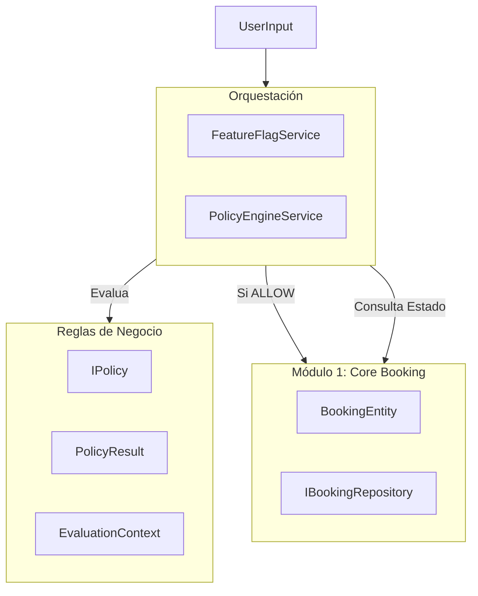

# Diseño Módulo 2: Extensibilidad, Reglas y Feature Toggles

**Estado:** Diseño Propuesto  
**Fecha:** 2026-01-29  
**Dependencias:** Módulo 1 (Core Domain) - Inmutable.

## 1. Visión Arquitectónica

El Módulo 2 actúa como una capa de **Orquestación y Enriquecimiento** sobre el Módulo 1. Mientras el Módulo 1 garantiza la integridad física y transaccional (No-Overlap, Atomicidad), el Módulo 2 garantiza la validez del negocio (Reglas, Permisos, Flujos).

### Bounded Context & Responsabilidades
Este módulo intercepta los Comandos del usuario antes de que lleguen al Core del Módulo 1 o enriquece sus resultados.

*   **Dominio M2 (Policy Engine):** Define *qué* es válido según la configuración. No sabe de persistencia.
*   **Aplicación M2 (Use Cases):** Coordina `PolicyEngine -> Repository (M1)`.
*   **Infraestructura M2:** Adapters para cargar reglas (JSON, DB, Hardcoded) y evaluar Feature Flags.

### Diagrama de Capas (Textual)



---

## 2. Especificación del Policy Engine

El motor es un evaluador puro y sin estado (stateless evaluator) que recibe un contexto y una cadena de políticas.

### interfaces (Conceptuales TS)

```typescript
// Resultado de una evaluación
type PolicyDecision = 'ALLOW' | 'DENY' | 'REQUIRE_ACTION';

interface PolicyResult {
  decision: PolicyDecision;
  reason?: string; // Obligatorio si DENY
  code?: string;   // Código de error estable (ej. 'LEAD_TIME_VIOLATION')
  actionDetails?: any; // Datos extra si REQUIRE_ACTION
}

// Contexto único para todas las reglas
interface PolicyContext {
  command: 'CREATE_HOLD' | 'CONFIRM' | 'CANCEL' | 'RESCHEDULE' | 'BLOCK';
  msg: TimeSlotRequest | { bookingId: string }; // Payload
  actor: BookingActor;
  resourceId: string;
  timeNow: Date;     // Inyectado por IClock
  targetBooking?: Booking; // Si aplica (ej. cancelaciones)
  metadata?: Record<string, any>;
}

interface IPolicy {
  name: string;
  // Retorna promesa por si alguna regla necesita async I/O (ej. chequear reputación externa)
  evaluate(ctx: PolicyContext): Promise<PolicyResult>;
}
```

### Composición y Orden
*   **Evaluación Secuencial:** Las políticas se ejecutan en un orden de prioridad definido (ej: Primero `AccessControl`, luego `AvailabilityLogic`, luego `BusinessConstraint`).
*   **Estrategia Fail-Fast:** Al primer `DENY`, la cadena se detiene y retorna el error.
*   **Prioridad:**
    1.  **Blocker Policies:** Seguridad, Bloqueos Admin.
    2.  **Logic Policies:** Horarios, Ventanas de tiempo.
    3.  **Soft Policies:** Límites de uso, Frecuencia.

---

## 3. Catálogo de Políticas Iniciales (Agnósticas)

Estas reglas se instancian con configuración, no se hardcodean por industria.

| Nombre Política | Parámetros (Config) | Lógica General |
| :--- | :--- | :--- |
| **ActorPermissionPolicy** | `allowedRoles: string[]` | Valida que `ctx.actor.type` esté en la lista permitida para el comando. |
| **OperationalHoursPolicy** | `schedule: { day: [start, end] }` | Valida que `start` y `end` del request caigan dentro del horario operativo definido. |
| **LeadTimePolicy** | `minHours: number` | `DENY` si `ctx.request.start < timeNow + minHours`. (Evita reservas sorpresa). |
| **MaxAdvancePolicy** | `maxDays: number` | `DENY` si `ctx.request.start > timeNow + maxDays`. (Evita reservas a 2 años vista). |
| **TimeBlockPolicy** | `grain: 15|30|60` | `DENY` si `start` o `duration` no alinean con la grilla de tiempo (ej. empezar 10:07). |
| **CancellationWindowPolicy** | `deadlines: { hours: number, penalty: string }[]` | En comando CANCEL, decide si permite cancelar o requiere acción (penalización) según cercanía al evento. |
| **BufferPolicy** | `before: min, after: min` | Requiere consultar disponibilidad expandida `[start-before, end+after]`. Si M1 detecta conflicto en ese rango extendido, `DENY`. |

---

## 4. Feature Toggles (Flags)

Sistema simple de activación/desactivación de ramas de lógica.

### Definición
*   **Alcance:** Global por despliegue (Cliente único).
*   **Evaluación:** En tiempo de ejecución (Runtime).

### Naming Convention
Uso de `SNAKE_CASE` con prefijos semánticos:
*   `ENABLE_`: Activa una funcionalidad nueva o módulo opcional (ej. `ENABLE_WAITLIST`).
*   `REQUIRE_`: Cambia una validación a obligatoria (ej. `REQUIRE_EMAIL_VERIFICATION`).
*   `ALLOW_`: Permite un comportamiento relajado (ej. `ALLOW_OVERLAPPING_ADMIN`).

### Flags Iniciales
*   `ENABLE_MANUAL_CONFIRMATION`: Si `true`, `createHold` deja la reserva en `PENDING` indefinidamente (o con TTL largo) hasta acción de Staff. Si `false`, podría pasar a `CONFIRMED` automático (dependiendo de reglas de pago, fuera de scope aquí).
*   `ALLOW_GUEST_BOOKING`: Si `true`, permite `ActorType.GUEST`. Si `false`, solo `USER` registrado.

### Interfaz Provider
```typescript
interface IFeatureFlagProvider {
  isEnabled(flag: string): Promise<boolean>;
  getAll(): Promise<Record<string, boolean>>;
}
```

---

## 5. Puntos de Extensión (Ports)

Interfaces Hexagonales para conectar este módulo con el exterior (M3 Configuración, Infra).

1.  **`IPolicyProvider`**
    *   Método: `getPoliciesForResource(resourceId: string): Promise<IPolicy[]>`
    *   Responsabilidad: Recuperar la lista ordenada de reglas activas y configuradas para ese recurso. (En M3 esto leerá de un JSON o columna de DB).

2.  **`IFeatureFlagProvider`**
    *   Método: `isEnabled(key: string): Promise<boolean>`
    *   Responsabilidad: Abstraer el origen de los flags (Env vars, DB, servicio remoto).

3.  **`IAuditLogger`** (Contrato M5)
    *   Método: `logEvent(event: DomainEvent): void`
    *   Responsabilidad: Registrar decisiones del Policy Engine (especialmente `DENY`) para análisis futuros.

---

## 6. Contratos de Domain Events

Eventos puros (DTOs) que el módulo emite. No implementamos el bus aún, solo el payload.

*   `HoldCreated { bookingId, resourceId, period, actor, expiresAt }`
*   `BookingConfirmed { bookingId, actor, timestamp }`
*   `BookingCancelled { bookingId, reason, actor, timestamp }`
*   `PolicyDenied { resourceId, command, reason, actor, policyName, timestamp }` -> Crítico para debug de reglas.

---

## 7. Checklist de Validación M2

- [ ] Se puede configurar una regla de "Mínimo 24hs de anticipación" SIN modificar el código del Core M1.
- [ ] Se puede deshabilitar las reservas de invitados (`ALLOW_GUEST_BOOKING=false`) mediante una env var o config, y el sistema las rechaza.
- [ ] El `PolicyEngine` recibe el `IBookingRepository` (M1) inyectado para hacer chequeos complejos (ej. BufferPolicy) sin romper capas.
- [ ] Si una regla falla, el error retornado al usuario es descriptivo ("Falta tiempo de anticipación") y no un error genérico de base de datos.
- [ ] No hay ninguna referencia a "Corte de Pelo" o "Consulta Médica" en el código, todo son "Resources" y "Services".

## 8. Riesgos y Mitigaciones

*   **Riesgo:** Performance en Policy Chain.
    *   *Mitigación:* Mantener las reglas "in-memory" configuradas al inicio, evitar I/O pesado (DB calls) dentro de loops de reglas siempre que sea posible. Usar `fail-fast`.
*   **Riesgo:** Conflicto entre reglas (ej. Allow vs Deny).
    *   *Mitigación:* El orden es estricto. La primera regla restrictiva gana. Módulo 3 (Configuración) deberá tener validadores de consistencia.
*   **Riesgo:** BufferPolicy vs EXCLUDE.
    *   *Mitigación:* EXCLUDE (M1) es la verdad física absoluta. BufferPolicy (M2) es una capa de "confort". Si Buffer falla la lógica, se niega *antes* de intentar insertar. Si M1 falla EXCLUDE, es un overlap real. Son complementarios.
